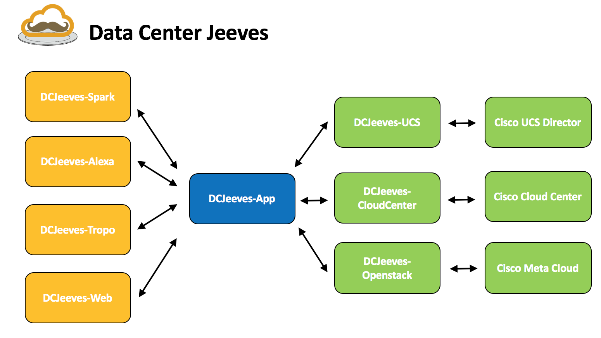
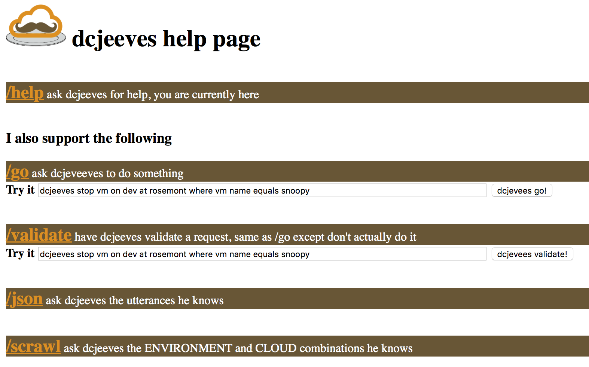

# DCJeeves App
DCJeeves App is an adaptable datacenter middleware appliacation. Its goal is to make your life easier by providing an interactive interface through natural spoken language into actionable funcations in your datacenter.

Lets take a look at the basic plugin-n-play architecture:

## Basic functions and the /help page
Interfacing with dcjeeves_app is done via its REST API.  The easiest way to consume and discover how the application works is to just visit the help page.  

An example of what this may look like

Here a user can explore the functions dcjeeve_app supports as well test out calls to back end modules.  

## Keep the simplicity spirit alive
Dcjeeves_app is meant to be easily consumed.  Although not always easy to accomplish the idea of developing plugins to dcjeeves_app should always consider the following rules
* The application should be able to present and identify what it is capable of to front end plugins.  This allows front end plugins to be able make use of the application without any confguration.
* Interfacing with backend plugins should be accomplished in a recursive automated way.  This allows for dcjeeves_app to be able to consume new features and functions of the backend plugins without knowing about them.  For examples on what this may look like, consider looking at the UCSD documentation.
* The point of entry where humans interface with DC Jeeves should be done in natural language as one would ask for something to be done.

## Config Files
Deployment of the application requires proper configuration of these files.

**scrawl.yaml**
This configuration file holds connection information for backend plugins.  More details are found in the file itself.  Copy and rename the provided template to the base directory / *scrawl.yaml*.

** utterance.conf**
This configuration file holds the commands (utterances) the app currently supports.  More details are found in the file itself.  Copy and rename the provided template to the base directory / *utterance.conf*.

